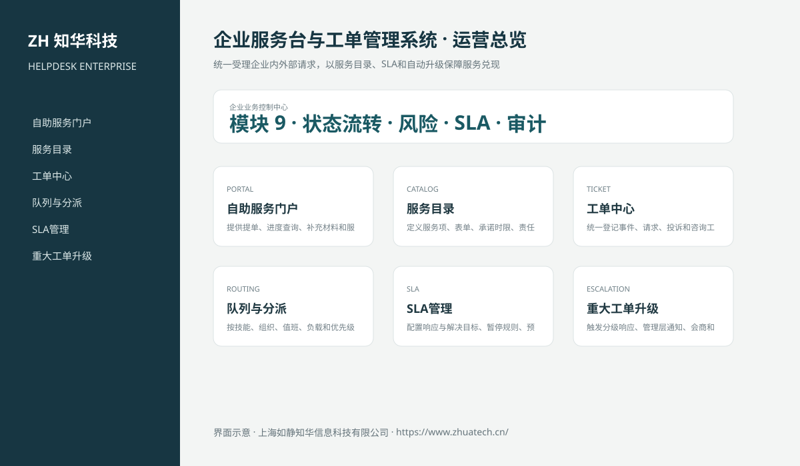

# ZhuaTech HELPDESK｜企业服务台与工单管理系统

## 企业级重大事件治理

新增 P1/P2 事件指挥官、干系人沟通、回退方案、处置证据和复盘频率控制，详见 [重大事件治理](docs/ENTERPRISE_MAJOR_INCIDENT.md)。

## 企业级问题管理闭环

新增问题关闭治理接口，覆盖根因验证、受影响服务映射、永久修复、关联事件清零、变更证据、稳定性观察、业务验收、职责分离与审计留痕；临时规避方案、知识文章和残余风险进入结构化复核清单。详见[问题关闭治理说明](docs/ENTERPRISE_PROBLEM_CLOSURE.md)。

> 统一受理企业内外部请求，以服务目录、SLA和自动升级保障服务兑现

ZhuaTech HELPDESK 是知华科技（上海如静知华信息科技有限公司）发布的企业级源码项目，面向“服务门户、服务目录、工单、队列、分派、SLA、升级、知识库、满意度与服务分析”提供管理端与响应式业务端。工程采用前后端分离架构，所有示例数据均为虚构数据。

[知华科技官网](https://www.zhuatech.cn/) · [架构说明](docs/ARCHITECTURE.md) · [API 文档](docs/API.md) · [企业能力](docs/ENTERPRISE.md) · [测试说明](docs/TESTING.md)



## 业务模块

| 模块 | 核心能力 |
| --- | --- |
| 自助服务门户 | 提供提单、进度查询、补充材料和服务评价 |
| 服务目录 | 定义服务项、表单、承诺时限、责任组和审批 |
| 工单中心 | 统一登记事件、请求、投诉和咨询工单 |
| 队列与分派 | 按技能、组织、值班、负载和优先级自动路由 |
| SLA管理 | 配置响应与解决目标、暂停规则、预警和违约升级 |
| 重大工单升级 | 触发分级响应、管理层通知、会商和复盘 |
| 服务知识库 | 维护标准答案、解决方案、版本、审核和使用反馈 |
| 满意度与质检 | 执行评价、回访、抽检、申诉和改进计划 |
| 服务运营分析 | 分析首响、解决率、积压、违约和人员负载 |


## 本次深化的核心服务台能力

- 独立工单实体与事件时间线，覆盖创建、分派、首次响应、解决、关闭和重开；
- 分别计算首次响应 SLA 与解决 SLA，提供违约与 P1 积压汇总；
- 等待客户时暂停 SLA，恢复处理时顺延服务时限并记录暂停分钟数；
- 未分派、未首次响应或处于等待状态的工单禁止直接解决；
- 关闭后只允许通过重开流程恢复，完整保留重开次数与事件证据；
- 前端新增 SLA 工单指挥台，支持一线人员按状态推进工单。
- 新增人工升级与 SLA 逾期自动扫描，支持三级升级、专家组转派和升级事件留痕；
- 二级以上升级自动提升为 P1，普通操作员不能执行管理员升级任务；
- 已关闭工单支持一次性 1–5 分满意度评价，并汇总评价数量和平均得分。

## 企业级控制

- ADMIN / OPERATOR 角色边界和管理员接口隔离；
- 服务端字段、模块、唯一编号和状态迁移校验；
- 组织、期间、责任人、风险等级、到期日和 SLA 统计；
- 幂等创建、JPA 乐观锁、重复提交保护和职责分离；
- 附件 SHA-256 元数据、业务凭证完整性与全流程审计；
- 组合检索、分页、逾期筛选、UTF-8 CSV 导出和协作时间线；
- 外部系统仅预留适配器，使用方自行配置地址与凭据；
- prod profile 拒绝默认密码、弱数据库口令和本地跨域来源。

## 技术架构

- 后端：Java 21、Spring Boot、Spring Security、JPA、Bean Validation、Actuator
- 前端：Vue 3、Vite、Axios，支持桌面端与移动端响应式布局
- 数据库：MySQL 8；自动化测试使用 H2
- 交付：Docker Compose、Nginx、环境变量、GitHub Actions
- Java 包名：`cn.zhuatech.helpdesk`

## 启动与测试

```bash
cd backend && mvn test
cd ../frontend && npm install && npm run build
cd .. && cp .env.example .env && docker compose up --build
```

开发演示账号：`admin / admin123`、`operator / operator123`。生产环境必须通过环境变量替换全部默认凭据。

## 许可与商业授权

Copyright © 2026 上海如静知华信息科技有限公司。

本工程仅允许个人学习、研究和非商业技术交流，**不得用于商业用途**。企业内部使用、生产部署、SaaS运营、项目交付、品牌替换、收费培训、咨询实施或再分发，均须事先获得上海如静知华信息科技有限公司书面授权，详见 [LICENSE](LICENSE)。

深度开发、私有化部署、系统集成与企业数字化咨询，请访问[知华科技官网](https://www.zhuatech.cn/)或扫码联系：

| 微信咨询一 | 微信咨询二 |
| --- | --- |
|  |  |

SEO：企业服务台与工单管理系统、HELPDESK系统源码、企业数字化、Java企业系统、Vue管理系统、知华科技、上海如静知华信息科技有限公司。
